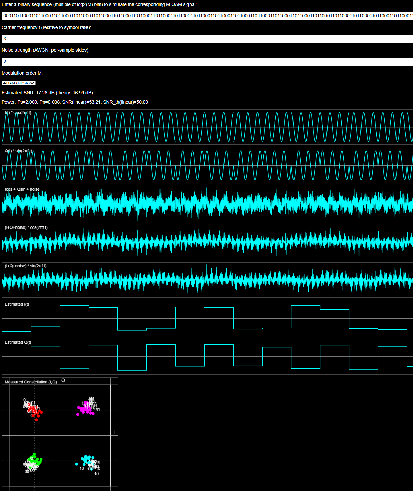

# QAM Interactive Simulator

An interactive, single‑file HTML/JS simulator for square M‑QAM. Enter a bit sequence, choose the modulation order (4/16/64/256), adjust carrier frequency and noise, and see waveforms, constellation, and SNR update live.

## Features

- Modulation order selector: 4‑QAM, 16‑QAM, 64‑QAM, 256‑QAM
- Bit sequence input (multiple of `log2(M)` bits per symbol)
- Adjustable carrier frequency `f` (relative to symbol rate)
- Adjustable noise strength `σ` (AWGN)
- Time‑domain plots: `I·cos`, `Q·sin`, combined passband, mixer outputs
- Estimated baseband `I(t)` and `Q(t)` via per‑symbol least‑squares (integrate‑and‑dump equivalent for orthogonal carriers)
- Constellation of measured `(Iest, Qest)` with static per‑order scaling and a fixed‑size canvas
  - Visible boundaries/grid at all PAM levels and decision lines
- SNR display: measured and theoretical, plus Ps/Pn power readout

## How It Works

### Modulation (Transmitter)

- The input stream is grouped into symbols of `m = log2(M)` bits. For square M‑QAM, `k = m/2` bits map to each axis (I and Q).
- Per‑axis Gray‑coded PAM mapping to odd integer levels: `±1, ±3, …, ±(√M−1)`.
- For 4‑QAM (QPSK), mapping is `0 → −1`, `1 → +1` on each axis (so `00` is bottom‑left, `11` top‑right).
- Carriers: cosine for I and sine (90° shifted) for Q at frequency `f` (relative to symbol rate).
- Transmitted signal:

  `s(t) = I(t)·cos(2π f t) + Q(t)·sin(2π f t)`

### Demodulation (Receiver)

- Multiply the received signal by local `cos(2π f t)` and `sin(2π f t)` (mixers).
- Estimate `Iest` and `Qest` per symbol using a least‑squares solve over the cosine/sine basis. With integer `f` (cycles per symbol), this reduces to integrate‑and‑dump. Non‑integer `f` is also supported via the LS formulation.

### Constellation

- Plots the measured `(Iest, Qest)` per symbol.
- Static min/max per QAM order (square M‑QAM): the display spans the full
  decision region `±√M` on both axes; symbol levels lie at odd integers
  up to `±(√M−1)`.
- Visible guides:
  - Thin dashed lines at the symbol levels (odd integers).
  - Solid brighter lines at decision boundaries (midpoints, even integers).
  - An outlined bounding square around the valid region.
 - Points are clipped at the bounding square so noisy estimates remain visible
   within the fixed plot area.

## SNR and Power

- Measured SNR uses per‑symbol power:
  - `Ps = mean(I^2 + Q^2)` for the ideal symbol vector
  - `Pn = mean((Iest−I)^2 + (Qest−Q)^2)` error power
  - `SNR_linear = Ps / Pn`, `SNR_dB = 10·log10(SNR_linear)`
- Theoretical SNR (for the LS estimator with per‑sample noise `σ`): computed from the cosine/sine Gram matrix over a symbol. For orthogonal carriers over the symbol (integer `f`) this reduces to the familiar integrate‑and‑dump result `SNR_linear ≈ sps / (2·σ²)`.
- Samples‑per‑symbol (`sps`) used for estimation is fixed in the simulator, so changing `f` does not inflate SNR via extra averaging.

## Controls

- Modulation order `M`: 4, 16, 64, 256
- Bit sequence: string of `0`/`1` with length a multiple of `log2(M)`
- Frequency `f`: non‑negative number (relative to symbol rate)
- Noise strength `σ`: AWGN standard deviation (0 disables noise)

## Run It

- Open `index.html` in any modern web browser.
- Edit the bit sequence or adjust the controls to see real‑time updates.
